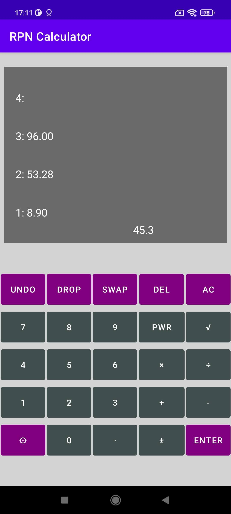
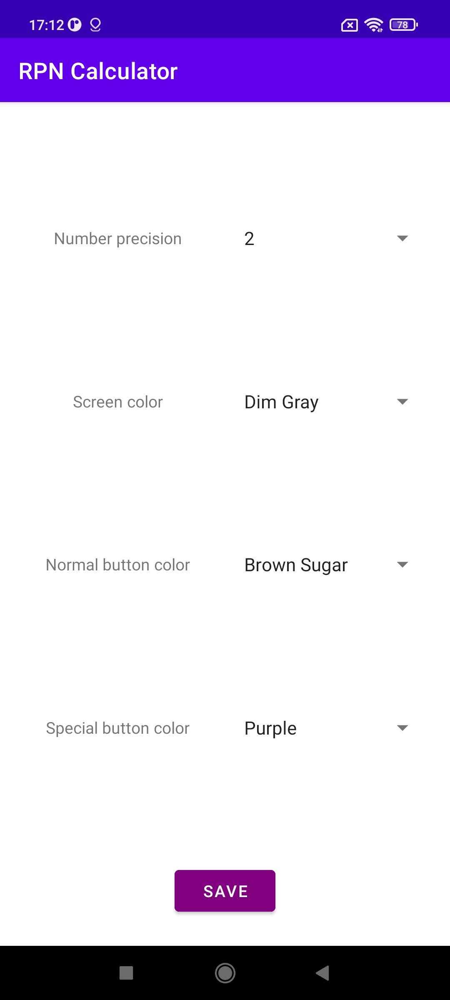

# RPN-Calculator
RPN Calculator Application for Android Devices

What is RPN? Check here for explanation: https://en.wikipedia.org/wiki/Reverse_Polish_notation

## Layout

  
  

## Functionality
Implemented application allows user to calculate basic math operations such as: `+`, `-`, `×`, `÷`, `PWR`, `√`.

And also:
- `UNDO` - undo operation (you can undo many steps till begining)
- `DROP` - remove first element from stack
- `SWAP` - swap two first elements in stack
- `DEL` - delete last character from input field
- `AC` - clear the whole stack
- `ENTER` - add element to stack from input field (if input field is empty, duplicate first element from stack)
- `±` - change sign of input field element (if input field is empty, change sign of first element from stack)
- `⚙` - open settings (change number precision, color of screen or buttons)

EXTRA: You can make `UNDO` by swiping right across the calculator screen.

### Device requirements
Minimum SDK: API21: Android 5.0 (Lollipop)
